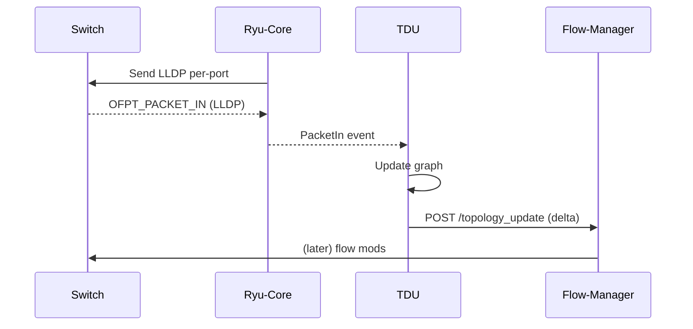
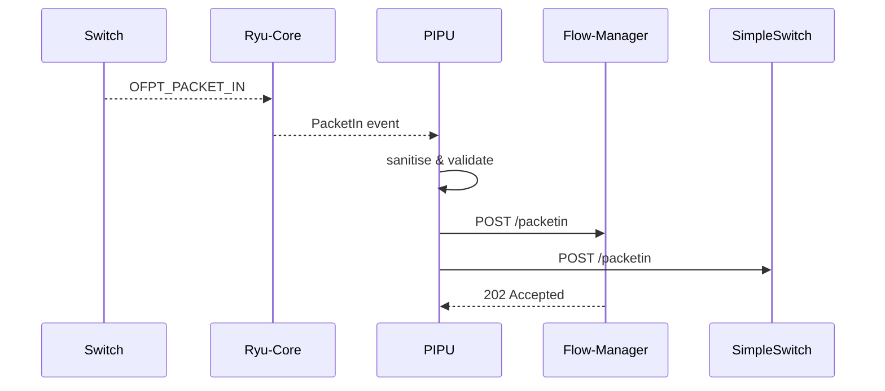

# Emitter Redesign Specification – TDU & PIPU

*Revision v0.2 – 29 Jun 2025*

---

## 1. Scope

Split the legacy **`ofp_emitter`** into two focused, secure micro-services within the eMSN SDN controller stack:

| Unit                                  | Responsibilities                                                                                                                         | Never Does                               |
| ------------------------------------- | ---------------------------------------------------------------------------------------------------------------------------------------- | ---------------------------------------- |
| **TDU** (Topology Discovery Unit)     | • Inject LLDP frames<br>• Sniff LLDP/ARP replies<br>• Maintain in-mem topology & host tables<br>• Push **delta** updates to Flow-Manager | ✗ Write to ETCD<br>✗ Forward Packet-Ins |
| **PIPU** (Packet-In Propagation Unit) | • Receive `EventOFPPacketIn` from Ryu-Core<br>• Sanitise metadata (no raw payload)<br>• POST to Flow-Manager **and** SimpleSwitch       | ✗ Touch ETCD<br>✗ Craft LLDP/ARP        |

Flow-Manager becomes the single writer to ETCD and the policy/security gateway.

---

## 2. High-level Architecture

```
+-------------------+          LLDP / ARP          +----------+     +--------------+
|  Ryu-Core Switch  | <--------------------------- |   TDU    | --> | Flow-Manager |
+-------------------+                              +----------+     +--------------+
        ^                                                     ^
        |  OFPT_PACKET_IN (metadata)                          | JSON (REST, mTLS)
        |                                                     |
+-------------------+  OpenFlow  +----------+     +--------------+
| OpenFlow Switches | ---------> |   PIPU   | --> | SimpleSwitch |
+-------------------+            +----------+ --> | Flow-Manager |
```

*TDU & PIPU run as RyuApps inside their own containers; north-bound APIs are REST/JSON secured by mTLS and/or JWT issued by NRF.*

---

## 3. API Contracts (v1)

### 3.1 `POST /flowmanager/topology_update`

```json
{
  "cid": "controller-1",
  "ts": "2025-06-29T12:34:56Z",
  "switches": { "1": { "status": "active" } },
  "hosts": { "10.0.0.1": { "dpid": 1, "port": 1, "mac": "aa:bb:…" } },
  "links": [ {"src_dpid":1,"src_port":3,"dst_dpid":2,"dst_port":2} ]
}
```

### 3.2 `POST /flowmanager/packetin`

```json
{
  "cid": "controller-1",
  "ts": "2025-06-29T12:34:56Z",
  "dpid": 1,
  "in_port": 4,
  "buffer_id": 1234,
  "eth_src": "aa:bb:…",
  "eth_dst": "ff:ee:…",
  "eth_type": 2048,
  "vlan": null,
  "ipv4_src": "10.0.0.1",
  "ipv4_dst": "10.0.0.2"
}
```

*Both endpoints return **202 Accepted** on enqueue, or 4xx/5xx on validation failure.*

---

## 4. Implementation Plan

1. **Refactor code** – lift LLDP/ARP & Packet-In logic from `ofp_emitter.py`.
2. **Pydantic schemas** – strict validation, `extra="forbid"`.
3. **Security layer** – mTLS + JWT (`NRF`) verification in Flow-Manager.
4. **Docker images** – Alpine 3.12, `ryu`, `aiohttp`, `pydantic`.
5. **CI/CD** – ruff ▸ mypy ▸ pytest ▸ schemathesis ▸ docker-build ▸ integration.

---

## 5. CI/CD Pipeline (GitHub Actions)

| Stage               | Jobs                                                         |
| ------------------- | ------------------------------------------------------------ |
| **Lint**            | ruff, black-check, mypy-strict                               |
| **Static Analysis** | bandit                                                       |
| **Unit Tests**      | pytest –m unit (≥ 90 % coverage)                             |
| **Contract Tests**  | schemathesis fuzz vs OpenAPI                                 |
| **Build**           | docker buildx (amd64 & arm64)                                |
| **Integration**     | docker-compose: Ryu-Core, Flow-Manager stub, TDU, PIPU, ETCD |
| **Publish**         | ghcr.io/emsn/tdu & ghcr.io/emsn/pipu                         |

---

## 6. Testing Strategy

*Unit* ➜ LLDP encode/decode, diff engine, sanitiser validation
*Integration* ➜ Stub Ryu emits events ➜ check POSTs
*E2E* ➜ Mininet traffic, Flow-Manager installs rules, topology converges.

---

## 7. Deployment

* `setup_env.sh` launches **TDU** & **PIPU** containers in place of legacy emitter.
* Certs mounted from `./certs`; ENV overrides for FM & SimpleSwitch URLs.

---

## 8. Migration Checklist

* [ ] Remove `ofp_emitter*.py` from controller images.
* [ ] Deploy TDU before PIPU.
* [ ] Update Flow-Manager to accept new endpoints.

---

## 9. Timeline (Weeks)

1. Repo split & API design
2. Port LLDP/ARP discovery
3. Port Packet-In sanitiser
4. Security integration
5. Integration & E2E tests
6. Docs + rollout

---

## 10. Open Points

* gRPC vs REST (keep REST first rollout).
* NRF key-management details.
* Flow-Manager back-pressure strategy.

---

## 11. Implementation Reference – TDU → Flow-Manager

OpenAPI & pydantic models *unchanged* from v0.1.

---

## 12. Implementation Reference – PIPU → Flow-Manager

OpenAPI & pydantic models *unchanged* from v0.1 (see Section 3).

---

## 13. Sequence Diagrams

### 13.1 Topology Discovery (LLDP/ARP)



### 13.2 Packet-In Propagation



---

## 14. TDU Microservice – Key Files

* **`app.py`** – RyuApp; loops LLDP inject, handles Packet-In (LLDP, ARP).
* **`lldp.py`** – craft/parse helpers.
* **`arp.py`** – host discovery.
* **`discovery_state.py`** – graph & diff.
* **`Dockerfile`** – Alpine image.

---

## 15. PIPU Microservice – Key Files

* **`app.py`** – RyuApp; sanitises Packet-In; async POST with retry/back-off and optional TLS.
* **`sanitizer.py`** – pydantic model + `sanitize()` parsing Ethernet/VLAN/IP.
* **`Dockerfile`** – Alpine image.

---

## 16. Master Checklist (snapshot)

**Phase 1 – Design**  ✔ complete
**Phase 2 – Coding**

* TDU logic  ✔
* PIPU skeleton  ✔
* Packet-In sanitiser  ✔ 29 Jun 2025 15:10 CEST
* REST client / retry  ✔ 29 Jun 2025 15:25 CEST
* CI workflows  ☐

**Phase 3 – Security**

* Design certificate hierarchy & JWT flow  ✔ 29 Jun 2025 15:40 CEST
* Implement mTLS on Flow-Manager  ☐
* Implement JWT issuance in NRF  ☐
* Integrate verification middleware  ☐

**Phase 4 – Testing**  ☐
**Phase 5 – Deployment**  ☐

---

## 17. Security Integration (mTLS + JWT)

### 17.1 Certificate hierarchy (NRF-CA)

| Entity       | Common Name (CN) | Key-usage      | Notes                                                             |
| ------------ | ---------------- | -------------- | ----------------------------------------------------------------- |
| Root CA      | NRF-Root-CA      | certSign       | kept offline                                                      |
| Flow-Manager | fm.domain-X      | server, client | presented on :8443, also for outbound to ETCD if mutual TLS there |
| TDU          | tdu.domain-X     | client         | outbound only                                                     |
| PIPU         | pipu.domain-X    | client         | outbound only                                                     |

**Openssl commands (dev):**

```bash
# Root CA
openssl genrsa -out root.key 4096
openssl req -x509 -new -key root.key -sha256 -days 3650 -out root.crt -subj "/CN=NRF-Root-CA"
# Leaf (example TDU)
openssl genrsa -out tdu.key 2048
openssl req -new -key tdu.key -out tdu.csr -subj "/CN=tdu.domain-X"
openssl x509 -req -in tdu.csr -CA root.crt -CAkey root.key -CAcreateserial -days 365 -out tdu.crt -sha256
```

### 17.2 mTLS configuration

* **Flow-Manager** serves HTTPS on `8443` with `--cert fm.crt --key fm.key --ca root.crt --require-client-cert`.
* **TDU & PIPU** set env: `TLS_CERT`, `TLS_KEY`, `CA_BUNDLE`. Their `aiohttp.ClientSession` uses:

```python
ssl_ctx = ssl.create_default_context(cafile=CA_BUNDLE)
ssl_ctx.load_cert_chain(TLS_CERT, TLS_KEY)
async with ClientSession(timeout=10, ssl=ssl_ctx) as s:
    await s.post(...)
```

### 17.3 JWT issuance & scope

* **NRF** acts as OAuth-like auth-server, signing HS256/RS256 tokens.
* Claims:

```json
{
  "iss": "NRF",
  "sub": "tdu.domain-X",
  "aud": "flow-manager",
  "iat": 1688040000,
  "exp": 1688040900,
  "scope": "topology:write"
}
```
* **TDU** requests token via mTLS channel at start-up, refreshes at 10 min interval.
* **PIPU** token scope: `packetin:write`.

### 17.4 Flow-Manager verification middleware (FastAPI example)

```python
import ssl, jwt, os
from fastapi import FastAPI, Request, HTTPException, Depends
from jwt import PyJWKClient

CA_BUNDLE = os.getenv("CA_BUNDLE", "/certs/root.crt")
JWKS_URL = os.getenv("JWKS_URL", "https://nrf:9443/.well-known/jwks.json")

app = FastAPI()

jwk_client = PyJWKClient(JWKS_URL)

def verify_token(req: Request):
    auth = req.headers.get("Authorization", "")
    if not auth.startswith("Bearer "):
        raise HTTPException(401, "No bearer token")
    token = auth[7:]
    signing_key = jwk_client.get_signing_key_from_jwt(token)
    try:
        payload = jwt.decode(token, signing_key.key, algorithms=["RS256"], audience="flow-manager")
    except jwt.PyJWTError as e:
        raise HTTPException(401, f"JWT error: {e}")
    scope = payload.get("scope", "")
    if req.url.path.startswith("/topology") and "topology:write" not in scope:
        raise HTTPException(403, "insufficient_scope")
    return payload

@app.post("/flowmanager/topology_update")
async def topo(body: dict, _: dict = Depends(verify_token)):
    ... # proceed to handle
```

### 17.5 Implementation steps

1. Bake **root.crt** into all images (`/certs/root.crt`).
2. Generate domain leaf certs during deploy (`setup_env.sh`).
3. Flow-Manager container exposes 8443 with `require_client_cert`.
4. Add token-fetch coroutine in TDU/PIPU to hit `https://nrf:9443/token` via mTLS.
5. Enable middleware above; reject unauthenticated or scope-violating calls.

